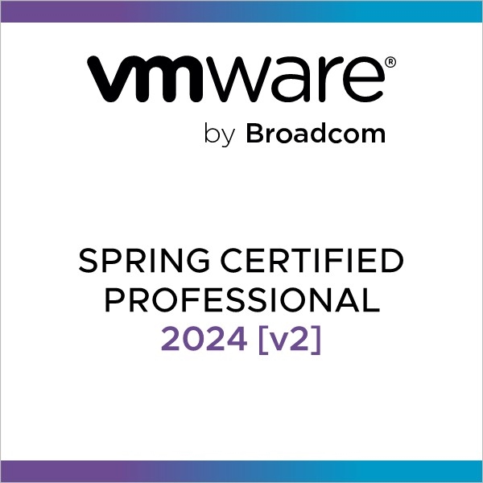
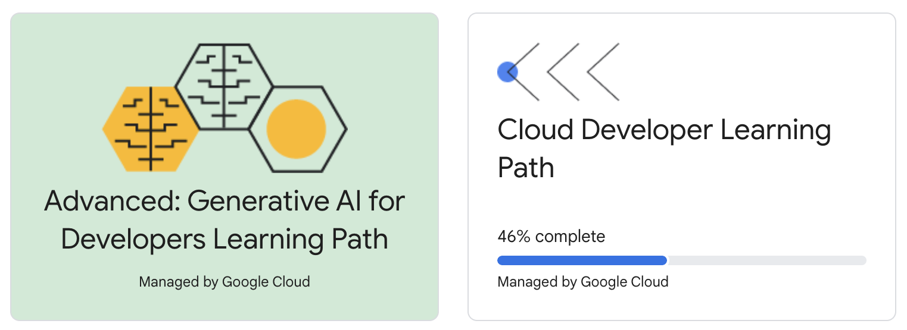

### Welcome
- 😎 Want to know about my skills ? Check this link [https://vifeng.github.io/](https://vifeng.github.io/)
- 🔥 See my last project (WIP) : [https://github.com/vifeng/TicketToTheMoon](https://github.com/vifeng/TicketToTheMoon)
- 🧲 Interests on my spare time : Google technologies, raspberry, iot...
- ✊ Grants : Google Get-Ahead EMEA Program Participant (2019), Google Travel Grant (2019)
- 💫 Fun fact : Being curious, I'm on a continous learning cycle ! I dived in La Seine River right in the middle of Paris in 2011 !
- Badges : 

- 🎓 Certifications badges : [https://www.credly.com/users/virginie-fengarol/badges](https://www.credly.com/users/virginie-fengarol/badges)
- 🎓 Google SkillBoost Profile : https://www.cloudskillsboost.google/public_profiles/dc7ec472-694c-4036-bf6f-9c965871a5d1

